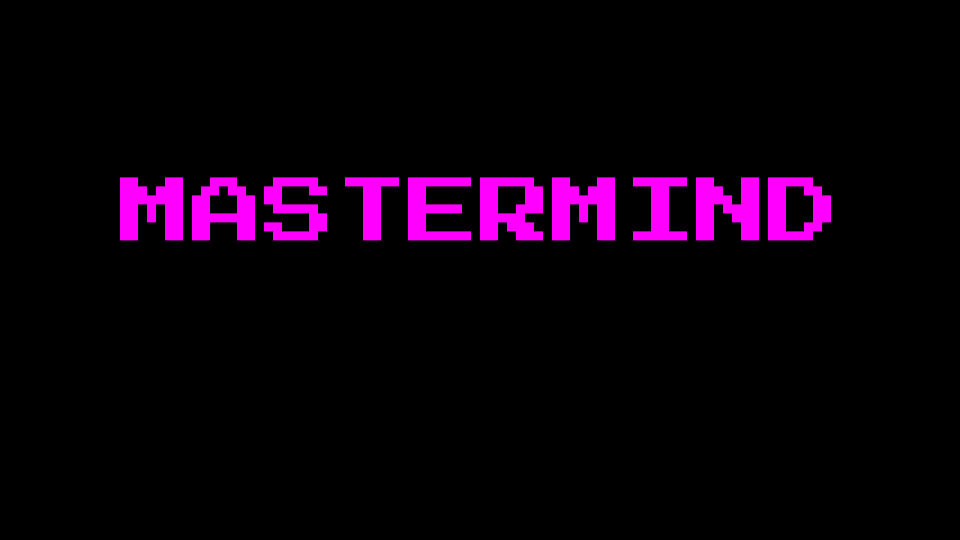
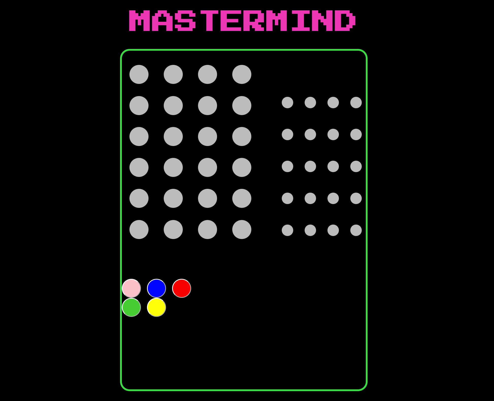
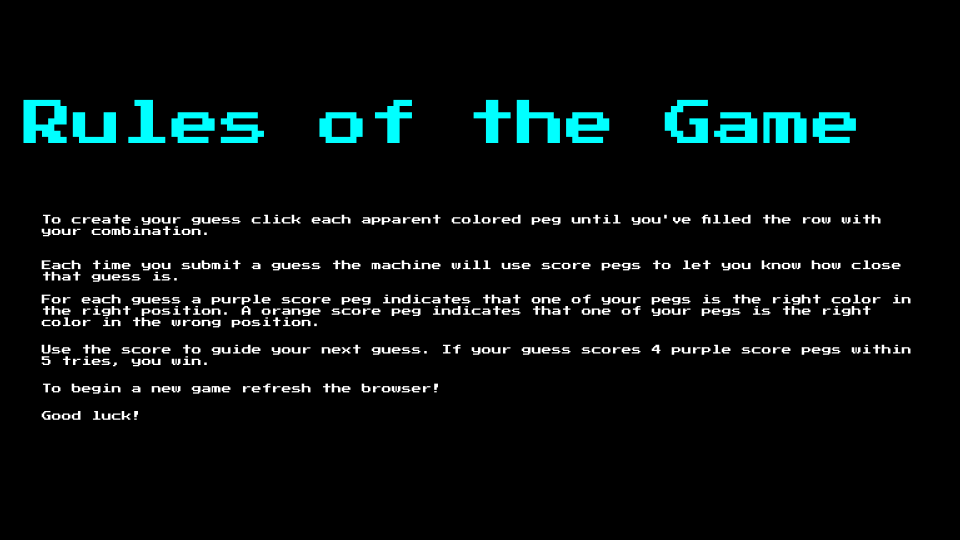

## MasterMind

Mastermind is a classic board game of logic and deduction. In the game, one player creates a secret code consisting of a sequence of colored pegs, and the other player (or players) attempt to guess the code within a limited number of turns. 
In this version of the game Mastermind after each guess, the code-maker provides feedback to the code-breaker, indicating how many pegs are the correct color and in the correct position (marked with orange and purple) and how many pegs are the correct color but in the wrong position. The code-breaker continues making guesses and refining their deductions until they either solve the code or run out of attempts. 

In this version of Mastermind there is an added layer of difficulty where there is no hint given of where the colors repeat themselves. 

# Technologies Used: 

Javascript, HTML, CSS

# Getting Started: 

Play Here! https://brobando.github.io/Project_1/

# Next Steps: 

Adding Buttons
    - Instructions
    
Adding Pop-Up Windows
    - Game Over message with two button selectors ( Try Again & Quit Game)
    - You Win message with two button selectors ( Try Again & Quit Game)

Integrating an audio component 
