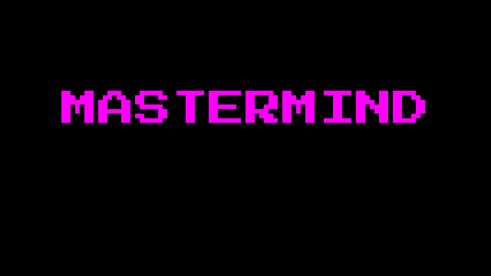
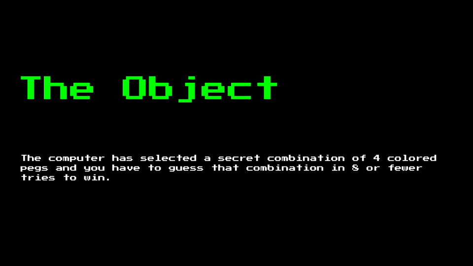
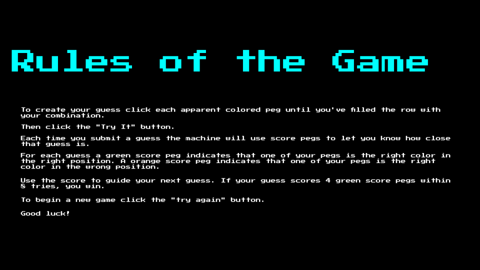
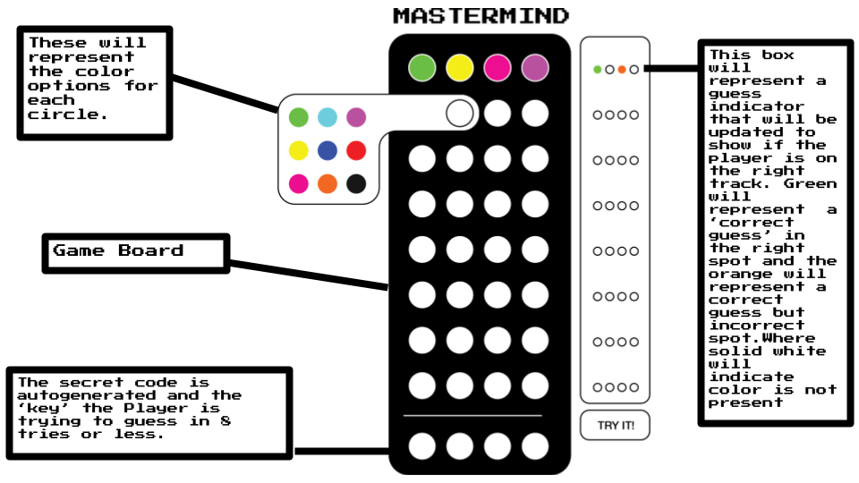
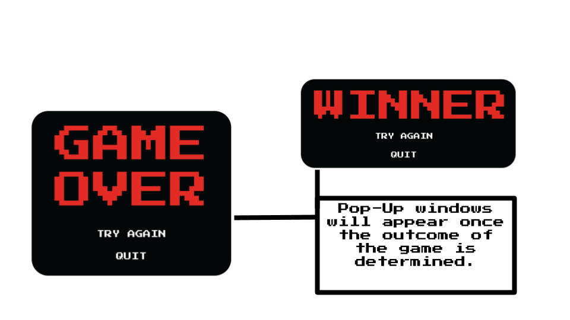

## User Stories
1. As a player I would like to start the game when I am ready. 
2. As a player I would like to have a list of rules to refer back to. 

## Psuedocode For The Overall MasterMind Game Play

Start Mastermind Game
  Generate a Secret Code:
    Create an array of four colored pegs (e.g., "Red", "Green", "Blue", "Yellow")
    Shuffle the array to randomize the secret code

Set Max Attempts to 5

For Each Turn in 1 to Max Attempts:
  Display Turn Number
  Prompt Player for a Guess:
    Read the player's input (four color choices)
    Validate the input for correctness

  Compare the Player's Guess to the Secret Code:
    For each peg position (1 to 4):
      If the guess peg matches the secret code peg and is in the correct position:
        Add a purple peg to the feedback
      If the guess peg matches the secret code peg but is in the wrong position:
        Add a orange peg to the feedback

  Display Feedback to the Player:
    Show the feedback pegs (purple and orange) to indicate correct guesses

  If Player's Guess Matches Secret Code:
    Display a Winning Message

End of For Loop (Max Attempts)
Display a Losing Message with the Secret Code
End Mastermind Game
